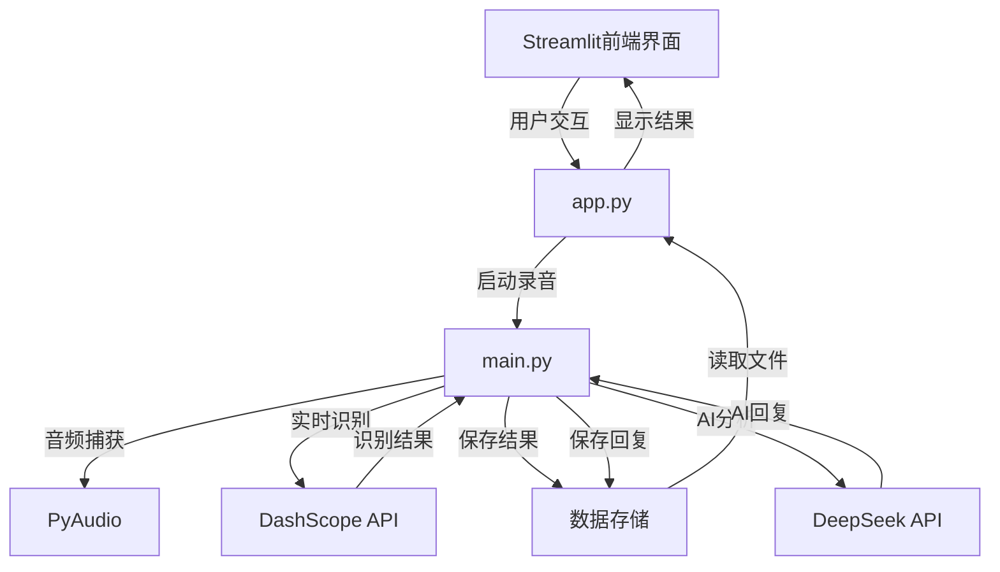
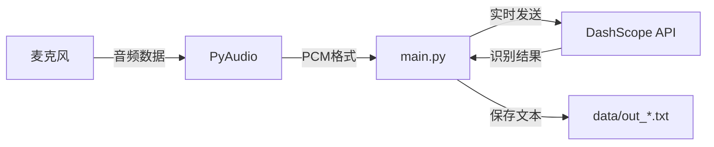
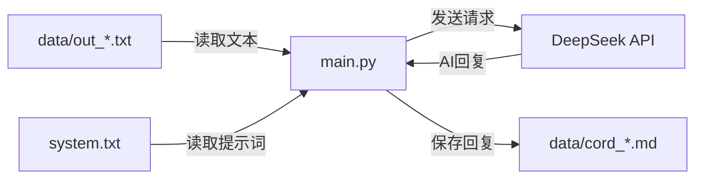

# 语音识别与AI交互系统 - 程序逻辑详解

## 1. 系统架构

### 1.1 整体架构



### 1.2 核心组件

| 组件 | 职责 | 文件 | 技术栈 |
|------|------|------|--------|
| 前端界面 | 用户交互、文件展示 | app.py | Streamlit |
| 核心处理 | 语音识别、AI调用 | main.py | Python、DashScope、OpenAI |
| 音频捕获 | 麦克风录音 | main.py | PyAudio |
| 数据存储 | 文件管理 | data/ | 本地文件系统 |
| 外部API | 语音识别、AI分析 | - | DashScope、DeepSeek |

## 2. 程序执行流程

### 2.1 启动流程

1. **应用启动**：运行 `streamlit run app.py` 启动前端界面
2. **初始化状态**：设置会话状态变量（recording、selected_file等）
3. **加载配置**：读取 system.txt 中的系统提示词
4. **显示界面**：默认显示主界面，包含功能介绍和使用流程

### 2.2 录音流程

1. **开始录音**：用户点击侧边栏"开始录音"按钮
2. **状态更新**：设置 recording=True，清空相关状态
3. **启动线程**：在后台线程中运行 main.py
4. **录音状态**：主界面显示录音中状态和语音识别文件列表
5. **音频捕获**：main.py 初始化 PyAudio，开始捕获麦克风音频
6. **实时识别**：将音频数据实时发送到 DashScope API
7. **结果处理**：接收并处理识别结果，保存到带时间戳的文件
8. **停止录音**：用户点击侧边栏"停止录音"按钮
9. **AI分析**：读取识别结果，调用 DeepSeek API 进行分析
10. **保存回复**：将 AI 回复保存到带时间戳的文件
11. **状态更新**：设置 recording=False，完成录音流程

### 2.3 文件查看流程

1. **选择文件**：用户在侧边栏或主界面点击文件按钮
2. **状态更新**：设置 selected_file 和 selected_file_content
3. **显示内容**：主界面显示选中文件的内容
4. **文件操作**：提供下载按钮，支持文件下载
5. **返回主界面**：用户点击"返回主界面"按钮，清空选择状态

## 3. 核心代码详解

### 3.1 前端界面 (app.py)

#### 3.1.1 状态管理

```python
# 创建状态变量
if 'recording' not in st.session_state:
    st.session_state.recording = False
if 'selected_file' not in st.session_state:
    st.session_state.selected_file = None
if 'selected_file_content' not in st.session_state:
    st.session_state.selected_file_content = ""
if 'system_prompt' not in st.session_state:
    # 读取system.txt内容
    if os.path.exists('system.txt'):
        with open('system.txt', 'r', encoding='utf-8') as f:
            st.session_state.system_prompt = f.read()
    else:
        st.session_state.system_prompt = "你是一个智能助手，帮助用户分析和处理输入的文本。"
```
<mcfile name="app.py" path="c:\LW\code\creator\deepseek_api\pure_AI_creat\app.py"></mcfile>

#### 3.1.2 侧边栏控制

侧边栏包含录音控制、系统提示词配置和文件管理三个主要部分：

1. **录音控制**：
   - 开始录音按钮：启动录音线程，运行 main.py
   - 停止录音按钮：创建停止信号文件，通知 main.py 停止录音

2. **系统提示词配置**：
   - 文本区域：允许用户编辑系统提示词
   - 保存按钮：将修改后的提示词保存到 system.txt

3. **文件管理**：
   - 语音识别文件列表：显示 data 文件夹中的 out_*.txt 文件
   - AI 回复文件列表：显示 data 文件夹中的 cord_*.md 文件
   - 系统文件下载：提供 system.txt 的下载按钮

#### 3.1.3 主界面状态

主界面根据会话状态显示不同内容：

1. **录音状态**：
   - 显示录音中提示
   - 显示最近的语音识别文件列表

2. **文件查看状态**：
   - 显示选中文件的内容
   - 提供文件下载按钮
   - 提供返回主界面按钮

3. **主界面状态**：
   - 显示系统功能介绍
   - 显示使用流程说明

### 3.2 核心处理 (main.py)

#### 3.2.1 音频参数配置

```python
# 录音参数配置
sample_rate = 16000  # 采样率 (Hz)
channels = 1  # 单声道
format_pcm = 'pcm'  # 音频格式
block_size = 3200  # 缓冲区大小
```
<mcfile name="main.py" path="c:\LW\code\creator\deepseek_api\pure_AI_creat\main.py"></mcfile>

#### 3.2.2 回调类实现

`Callback` 类继承自 `RecognitionCallback`，处理语音识别过程中的各种事件：

- **on_open**：初始化音频设备和输出文件
- **on_close**：关闭音频设备和输出文件
- **on_event**：处理识别结果，保存完整句子到文件
- **on_error**：处理错误情况，退出程序

#### 3.2.3 录音控制

1. **开始录音**：
   - 初始化识别服务
   - 建立 WebSocket 连接
   - 启动音频流
   - 进入主循环，持续发送音频数据

2. **停止录音**：
   - 检测停止信号文件
   - 停止音频流
   - 关闭识别服务
   - 开始 AI 分析流程

#### 3.2.4 AI 分析流程

```python
# 读取文件内容
with open(output_file_path, 'r', encoding='utf-8') as file:
    text = file.read()
# 读取system.txt文件内容
with open('system.txt', 'r', encoding='utf-8') as system_file:
    system_content = system_file.read()

# 发送请求到DeepSeek API
response = client.chat.completions.create(
    model="deepseek-chat",
    messages=[
        {"role": "system", "content": system_content},
        {"role": "user", "content": text}
    ],
    temperature=0.7,
    max_tokens=1000
)

# 保存AI回复
with open(cord_file_path, 'w', encoding='utf-8') as cord_file:
    cord_file.write(ai_response)
```
<mcfile name="main.py" path="c:\LW\code\creator\deepseek_api\pure_AI_creat\main.py"></mcfile>

## 4. 数据流程

### 4.1 音频数据流



### 4.2 文本分析流



### 4.3 文件命名规则

系统使用时间戳生成唯一的文件名，格式如下：

| 文件类型 | 命名格式 | 示例 | 保存路径 |
|---------|---------|------|---------|
| 语音识别结果 | out_YYYYMMDD_HHMMSS.txt | out_20260121_193045.txt | data/ |
| AI 回复 | cord_YYYYMMDD_HHMMSS.md | cord_20260121_193045.md | data/ |

## 5. 关键技术点

### 5.1 实时语音识别

- **技术实现**：使用 DashScope API 的实时语音识别服务
- **通信方式**：WebSocket 实时通信
- **数据处理**：分块发送音频数据，实时接收识别结果
- **性能优化**：使用回调机制处理识别事件，避免阻塞主线程

### 5.2 多线程处理

- **前端线程**：Streamlit 主线程，处理用户界面
- **录音线程**：后台线程，运行 main.py，避免阻塞前端
- **音频线程**：main.py 中的音频捕获线程
- **信号线程**：监听停止信号的线程

### 5.3 状态管理

- **会话状态**：使用 Streamlit 的 session_state 管理应用状态
- **文件状态**：通过文件系统状态反映处理进度
- **停止信号**：使用文件信号机制实现跨进程通信

### 5.4 文件监控

- **实时更新**：录音过程中实时读取识别结果
- **文件列表**：动态生成文件列表，按时间戳排序
- **文件操作**：支持查看、下载历史文件

## 6. 配置与部署

### 6.1 环境要求

| 依赖项 | 版本/用途 | 安装命令 |
|--------|----------|---------|
| Python | 3.7+ | - |
| Streamlit | 最新版 | `pip install streamlit` |
| DashScope | 最新版 | `pip install dashscope` |
| PyAudio | 最新版 | `pip install pyaudio` |
| OpenAI | 最新版 | `pip install openai` |

### 6.2 API 配置

在 main.py 中配置 API 密钥：

```python
# DashScope API 配置
dashscope.api_key = 'YOUR_DASHSCOPE_API_KEY'
dashscope.base_websocket_api_url='wss://dashscope.aliyuncs.com/api-ws/v1/inference'

# DeepSeek API 配置
api_key = "YOUR_DEEPSEEK_API_KEY"
base_url = "https://api.deepseek.com"
```
<mcfile name="main.py" path="c:\LW\code\creator\deepseek_api\pure_AI_creat\main.py"></mcfile>

### 6.3 部署步骤

1. **安装依赖**：`pip install -r requirements.txt`
2. **配置 API 密钥**：修改 main.py 中的 API 密钥
3. **启动应用**：`streamlit run app.py`
4. **访问应用**：在浏览器中打开 http://localhost:8501

## 7. 故障排除

### 7.1 常见问题

| 问题 | 可能原因 | 解决方案 |
|------|---------|---------|
| 录音无反应 | 麦克风权限问题 | 检查系统麦克风权限设置 |
| 识别结果不准确 | 环境噪音过大 | 在安静环境中使用，靠近麦克风 |
| API 调用失败 | API 密钥无效 | 检查 API 密钥配置 |
| 文件不显示 | 路径问题 | 确保 data 文件夹存在且可访问 |
| 应用崩溃 | 内存不足 | 关闭其他占用内存的应用 |

### 7.2 日志查看

- **Streamlit 日志**：终端中显示
- **main.py 日志**：终端中显示
- **API 调用日志**：包含在 main.py 输出中

## 8. 扩展功能建议

### 8.1 功能扩展

1. **多语言支持**：添加语言选择功能，支持多种语言识别
2. **语音合成**：集成 TTS 功能，将 AI 回复转换为语音
3. **历史管理**：添加数据库支持，实现更复杂的历史记录管理
4. **批量处理**：支持上传音频文件进行批量识别和分析
5. **云存储**：集成云存储服务，实现文件备份和同步

### 8.2 技术优化

1. **实时更新**：使用文件监控库实现更实时的文件更新
2. **错误处理**：增强错误处理机制，提高系统稳定性
3. **性能优化**：优化音频处理和 API 调用，减少延迟
4. **安全增强**：添加 API 密钥管理功能，避免硬编码
5. **容器化**：提供 Docker 部署方案，简化部署流程

## 9. 代码优化建议

### 9.1 前端优化

1. **组件化**：将界面元素拆分为可复用的组件
2. **状态管理**：使用更结构化的状态管理方案
3. **响应式设计**：优化不同屏幕尺寸的显示效果
4. **加载状态**：添加加载动画，提升用户体验
5. **缓存优化**：合理使用 Streamlit 的缓存功能

### 9.2 后端优化

1. **模块化**：将 main.py 拆分为多个模块，提高可维护性
2. **配置管理**：使用配置文件管理 API 密钥和参数
3. **错误处理**：添加更完善的错误处理和重试机制
4. **并发控制**：优化线程管理，避免资源竞争
5. **日志系统**：添加结构化日志，便于问题排查

### 9.3 性能优化

1. **音频处理**：优化音频数据处理，减少内存使用
2. **API 调用**：实现请求缓存，避免重复调用
3. **文件操作**：使用异步文件操作，提高性能
4. **资源管理**：确保正确释放资源，避免内存泄漏
5. **网络优化**：优化网络请求，减少延迟

## 10. 总结

本系统实现了一个功能完整的语音识别与 AI 分析系统，通过整合 DashScope 和 DeepSeek API，提供了以下核心价值：

1. **便捷的语音输入**：无需手动输入文本，通过语音即可完成交互
2. **智能的文本分析**：利用 AI 能力对语音内容进行深度分析
3. **友好的用户界面**：通过 Streamlit 提供直观的 Web 界面
4. **完整的文件管理**：支持查看、下载历史录音和分析结果
5. **灵活的系统配置**：可自定义系统提示词，适应不同场景

系统采用模块化设计，具有良好的可扩展性和可维护性。通过合理的多线程处理和状态管理，实现了流畅的用户体验。同时，系统提供了详细的错误处理和日志记录，确保了系统的稳定性和可靠性。

未来可以通过添加更多功能和优化现有代码，进一步提升系统的性能和用户体验，使其成为一个更加完善的语音识别与 AI 交互解决方案。